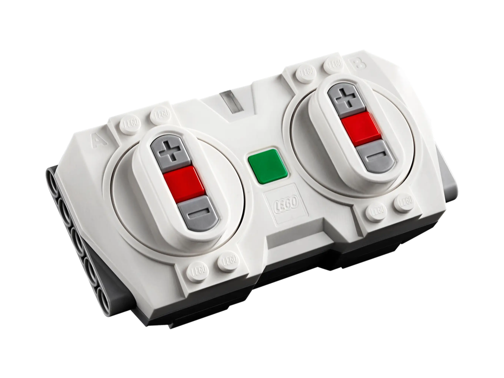

# `PoweredUp`

__Connect [LEGO® Powered Up](https://www.lego.com/themes/powered-up) hubs and control attached lights, motors and sensors from a friendly `@Observable` Swift interface.__

`PoweredUp` implements enough of the [LEGO® Wireless Protocol](https://lego.github.io/lego-ble-wireless-protocol-docs) to replace the [88010 Remote Control](https://www.lego.com/product/remote-control-88010) and drive the current generation of Powered Up attachments from the 2- and 4-port consumer hubs.

### Supported Powered Up Components

| Hubs | Attachments |
| --- | --- |
| [88012&nbsp;Technic™&nbsp;Hub ](https://www.lego.com/product/technic-hub-88012) | [ 88013&nbsp;Technic™&nbsp;Large&nbsp;Motor](https://www.lego.com/product/technic-large-motor-88013) |
| [  88009&nbsp;Hub](https://www.lego.com/product/hub-88009) | [ 88011&nbsp;Train&nbsp;Motor](https://www.lego.com/product/train-motor-88011) |
| &nbsp; | [ 88005&nbsp;Light](https://www.lego.com/product/light-88005) |

### Supported Platforms

Written in [Swift](https://developer.apple.com/documentation/swift) 6 for Apple stuff:

* [macOS](https://developer.apple.com/macos) 15 Sequoia
* [iOS](https://developer.apple.com/ios)/[iPadOS](https://developer.apple.com/ipad) 18
* [visionOS](https://developer.apple.com/visionos) 2

Build with [Xcode](https://developer.apple.com/xcode) 16 or newer.
