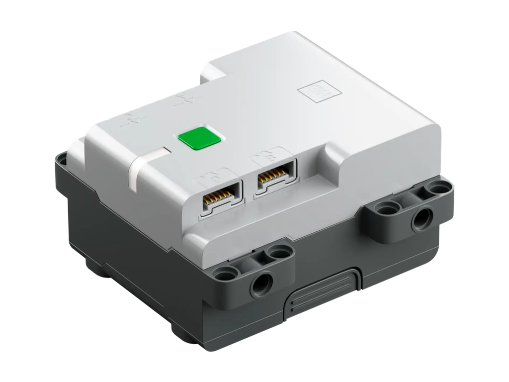
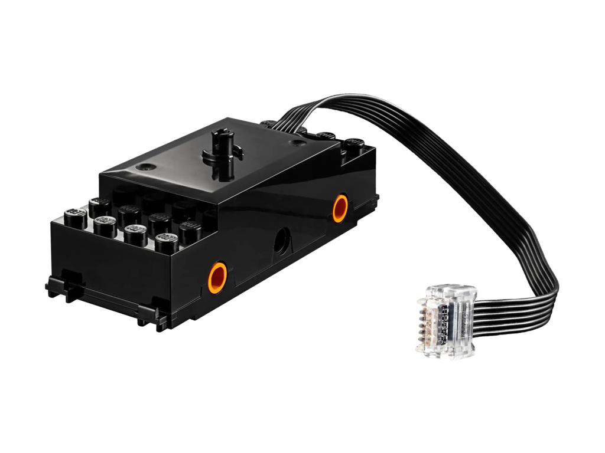
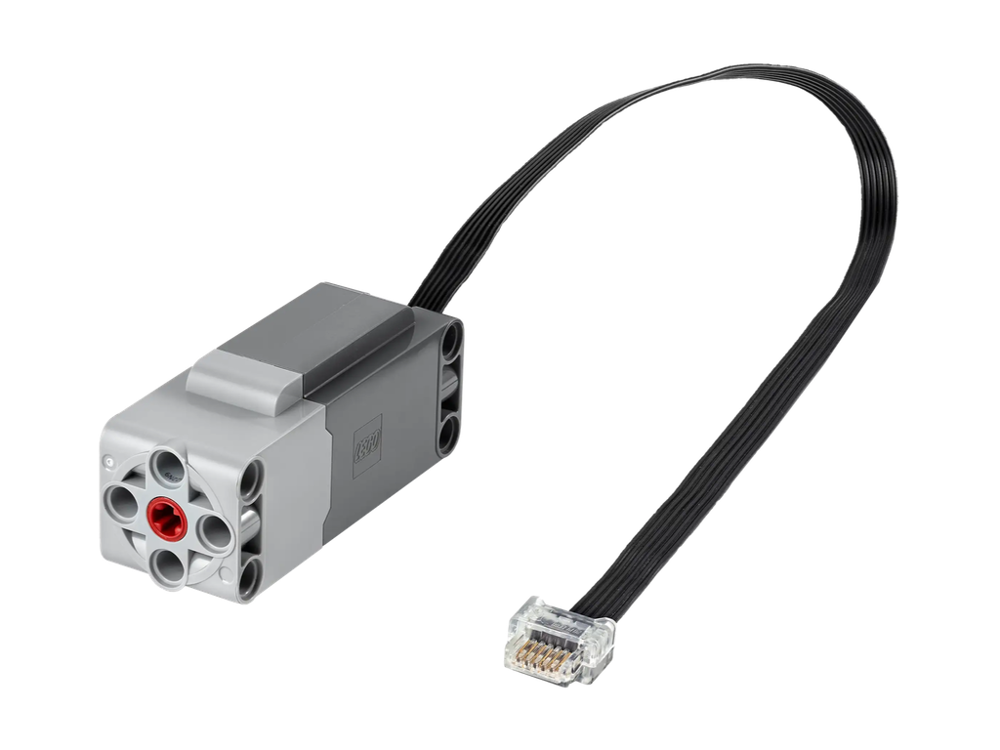
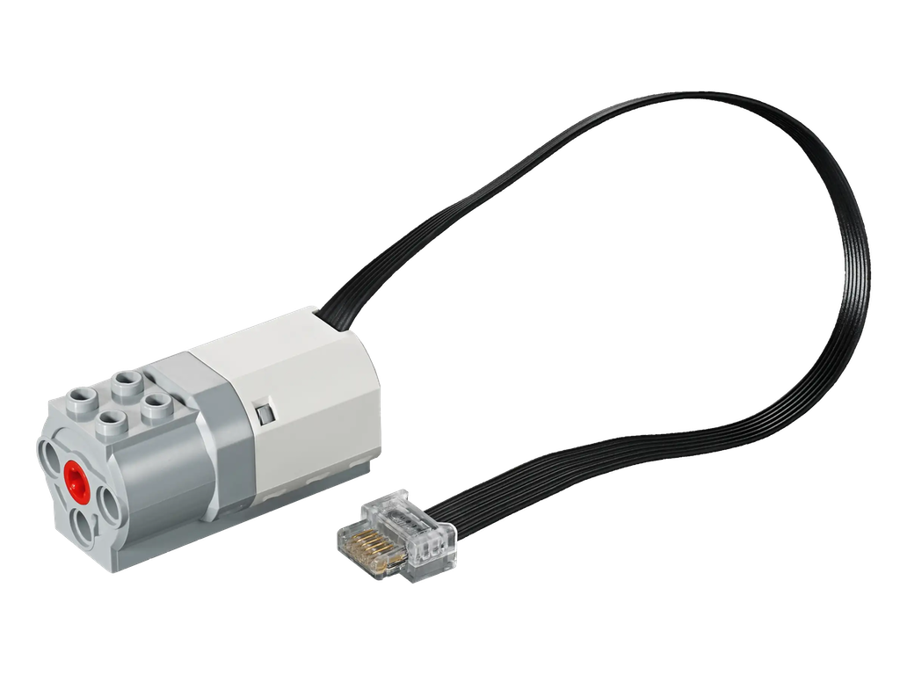
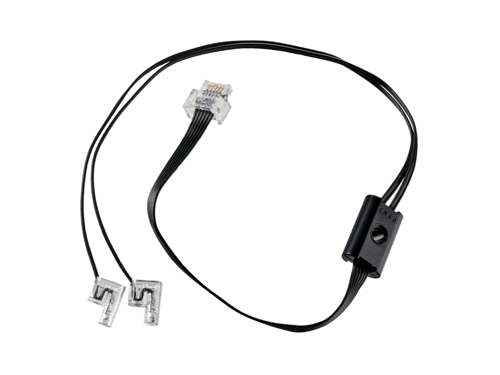
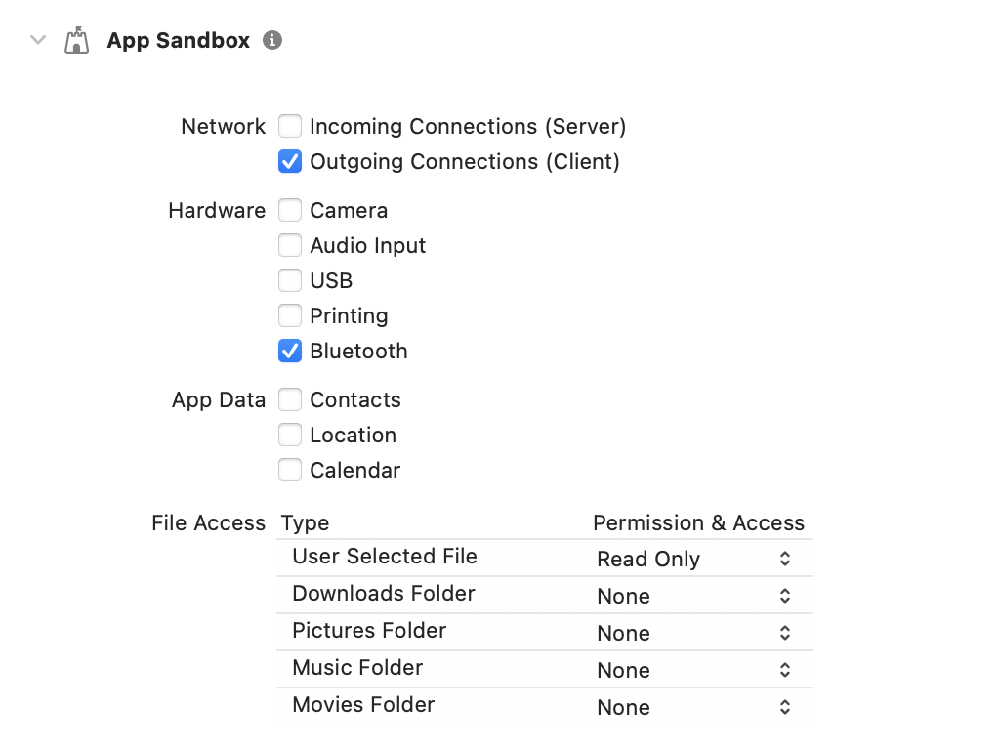
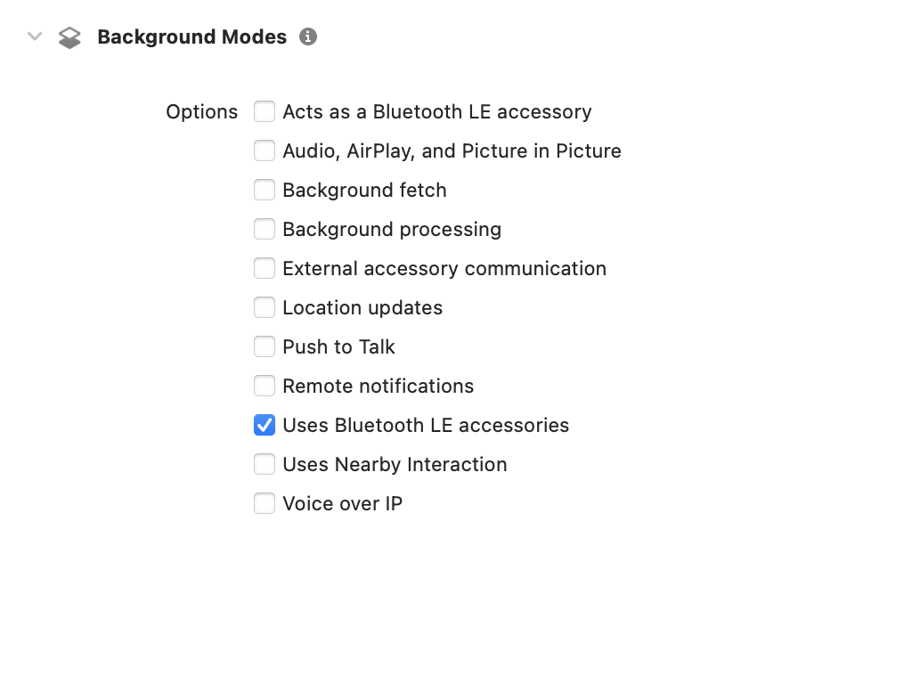

# `PFunc`

__Control LEGO® Powered Up motors and lights from an `@Observable` Swift interface__

`PFunc` talks to [LEGO® Powered Up](https://www.lego.com/themes/powered-up) hubs over Bluetooth Low Energy (BLE). [Core Bluetooth](https://developer.apple.com/documentation/corebluetooth) does the heavy lifting, managing connections and writing instructions to the hubs.

`PFunc` implements _just_ enough of the [LEGO® Wireless Protocol](https://lego.github.io/lego-ble-wireless-protocol-docs) to replace the [88010 Remote Control](https://www.lego.com/product/remote-control-88010) and drive the current generation of Powered Up  attachments from the 2- and 4-port consumer hubs.

### Supported Hubs

| [88012&nbsp;Technic™&nbsp;Hub](https://www.lego.com/product/technic-hub-88012) | [88009&nbsp;Hub](https://www.lego.com/product/hub-88009) |
| --- | --- |
|  |  |

### Supported Attachments

| [88011&nbsp;Train&nbsp;Motor](https://www.lego.com/product/train-motor-88011) | [88013&nbsp;Technic™&nbsp;Large&nbsp;Motor](https://www.lego.com/product/technic-large-motor-88013) |
| --- | --- |
|  |  |

| [45303&nbsp;Motor](https://www.lego.com/product/simple-medium-linear-motor-45303) | [88005&nbsp;Light](https://www.lego.com/product/light-88005) |
| --- | --- |
|  |  |

### Supported Platforms

Written in [Swift](https://developer.apple.com/documentation/swift) 6.2 for Apple stuff:

* [macOS](https://developer.apple.com/macos) 15 Sequoia
* [iOS](https://developer.apple.com/ios)/[iPadOS](https://developer.apple.com/ipad) 18
* [visionOS](https://developer.apple.com/visionos) 2

Build with [Xcode](https://developer.apple.com/xcode) 26 or newer.

## Instructions

Apps using `PFunc` are using Core Bluetooth. Your app will crash if its `Info.plist` doesn't include `NSBluetoothAlwaysUsageDescription` [privacy description.](https://developer.apple.com/documentation/uikit/protecting_the_user_s_privacy/requesting_access_to_protected_resources)

Additionally, app entitlements need to enable Bluetooth:

| macOS | iOS, visionOS |
| --- | --- |
|  |  |

[Add `p-func` package](https://developer.apple.com/documentation/xcode/adding-package-dependencies-to-your-app) to your Xcode project, then add `PFunc` library to the app target(s).

### Connect Hubs

Add `@Observable PFunc` object to the SwiftUI app environment; connect nearby hubs when Bluetooth is enabled:

```swift
import SwiftUI
import PFunc

@main
struct App: SwiftUI.App {
    @State private var pFunc: PFunc = PFunc()
    
    // MARK: App
    var body: some Scene {
        WindowGroup {
            ContentView()
                .environment(pFunc)
                .onChange(of: pFunc.state) {
                    if pFunc.state == .poweredOn {
                        pFunc.connect()
                    }
                }
        }
    }
}
```

All hub property updates are published:

* Advertising name (14-character ASCII string)
* Battery voltage (0-100%)
* Bluetooth signal strength (poor/fair/good w/ relative dbm) and connection status (`CBPeripheralState`)
* Built-in RGB light color (10 named presets or custom RGB 0-255)
* Ports and attached devices (automatically detect/init known `Device` types)

### Control Attached Devices

Detect when a device is attached to a port and operate functions:

```swift
import PFunc
import SwiftUI

struct RemoteControl: View {
    init(hub id: UUID) {
        self.id = id
    }
    
    @Environment(PFunc.self) private var pFunc: PFunc
    private let id: UUID
    
    private var device: Device? { pFunc.hub(id)?.device(at: .external(.a)) }
    
    // MARK: View
    var body: some View {
        Button(action: {
            if let light: LEDLight = device as? LEDLight {
                light.intensity = light.intensity == .off ? .percent(50) : .off
            } else if let motor: Motor = device as? Motor {
                motor.power = motor.power == .float ? .forward(50) : .float)
            }
        }) {
            Text("Toggle Device Function")
        }
        .disabled(device == nil)
    }
}
```

### Change Hub Name and RGB Light

Both advertising name and RGB light color are settable and resettable:

```swift
pFunc.hub(id)?.resetName("New Hub Name")
```

```swift
pFunc.hub(id)?.rgbLightColor = .red
```

Name changes are persisted on the hub across connections, until changed or reset. RGB light color always starts at hub default on connection. (To remember which hubs were which color last time connected, your app can depend on the Core Bluetooth peripheral `CBUUID` being the same across connections.)

## Thanks

I had a little help from the Internet:

* [Notes on LEGO wireless BLE protocol](https://virantha.github.io/bricknil/lego_api/lego.html)
* [Powered UP - Community Docs (the missing device docs ...)](https://github.com/sharpbrick/docs)
* [SmartBotKit LWP](https://github.com/smartbotkit/lwp)
